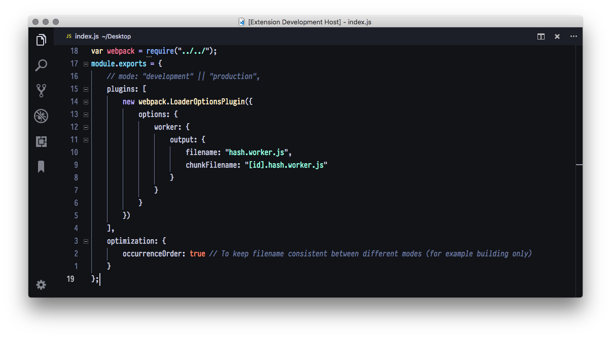

<h1 align="center">🔥 Gooey Theme 🔥</h1>

# About
This theme is just a port of [@bookerCodes](https://twitter.com/bookercodes) Gooey Theme. It's based on base16 theme called Gooey from [base16builder](https://github.com/base16-builder). Unfortunately, base16builder has some bugs, like it can't generate vscode themes due to some bug, and also it's generating old XML themes instead of .tmTheme (Repository isn't maintained any more). Hope you'll like this theme, like i do!

## Credits
Alex Booker - [@bookerCodes](https://twitter.com/bookercodes)  
Base16builder - [Github Repo](https://github.com/base16-builder)  
base16-vscode - [Github Repo](https://github.com/golf1052/base16-vscode)  

Big shoutout to [golf1052](https://github.com/golf1052) for providing VSCode Theme templates.

